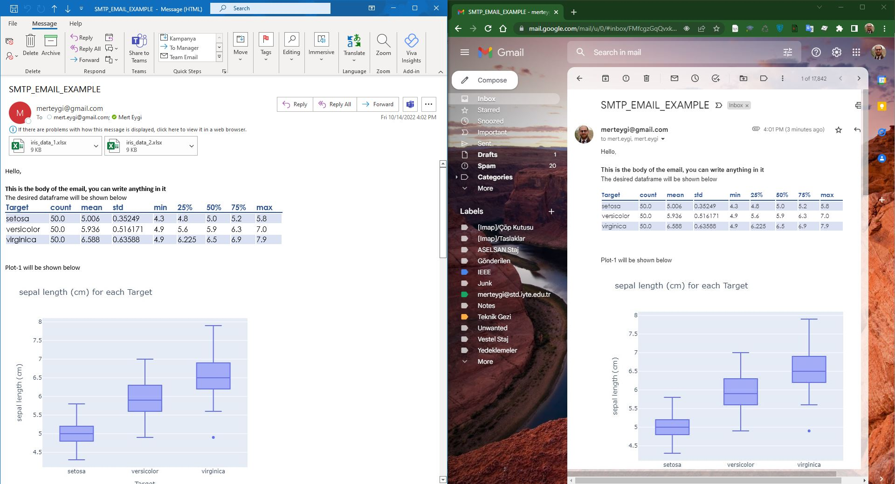

# sendEmailPython
You can send easily emails with python by using smtplib including images and tables in the body and some attachements.

If you schedule your script, your emails trigger automatically. 

The [SendSMTP_Example.ipynb](https://github.com/merteygi/sendEmailPython/blob/main/SendSMTP_Example.ipynb) shows an example to send an email with python. 
To create a data frame and get plots, I've used well-known sklearn iris dataset.

Since my aim is just giving an idea for sending email with python, I did not do any special work on the iris dataset so that you can easily apply the example I made.

If you want to use your GMAIL account for python scripting, you need the follow these steps;
* Go to -> https://myaccount.google.com/
* Under the security section, go to the ‘Signing in to Google’ part and select the ‘App Passwords’. 
If you don't see the ‘App Passwords’, please activate the 2-Step Verification.
* After selecting app and device, click the generate and store the generated app password.

## ScreenShots 
### Final Output View both in outlook and gmail

### Google Account Settings
#### Setting-1:

#### Setting-2:

#### Setting-3:

